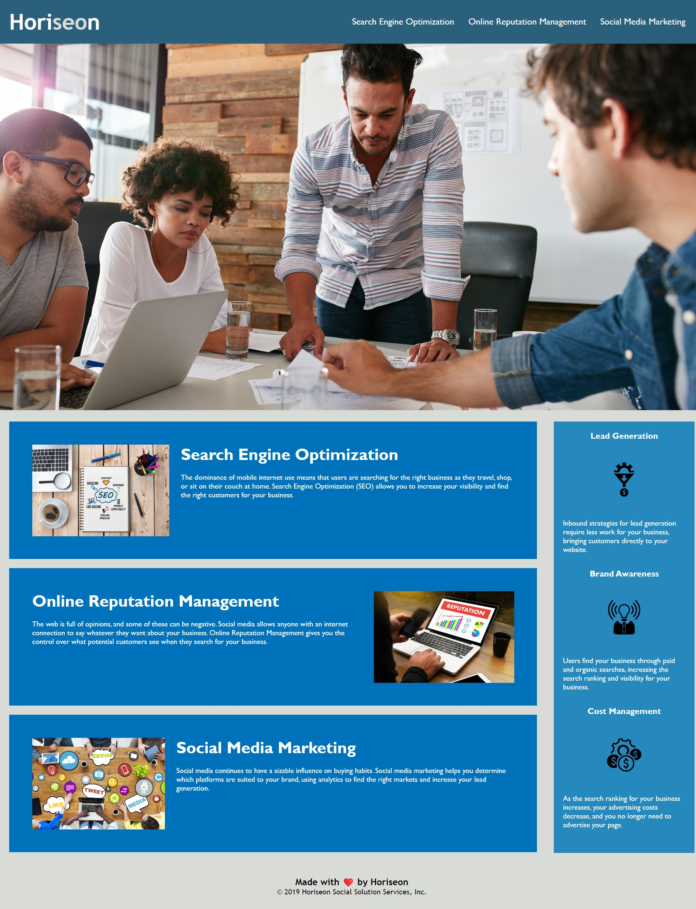

# Horiseon Social Solution Services 

## Description

Horiseon Social Solution Services wanted to update their site so that it is greater accessibility, easy to read code and has better maintainability 

- We took the contract to help Horiseon Social Solution Services achive their objective
- we have made changes and replace non semantic elements with semantic eliments, updated alt text for images etc.
- It was a greate learning experience for us and this work will help us gain more clients who have similar needs

## Installation

NA 
This site is available on git pages 

## Usage

Provide instructions and examples for use. Include screenshots as needed.

To add a screenshot, create an `assets/images` folder in your repository and upload your screenshot to it. Then, using the relative filepath, add it to your README using the following syntax:

    

    

## Credits

List your collaborators, if any, with links to their GitHub profiles.

If you used any third-party assets that require attribution, list the creators with links to their primary web presence in this section.

If you followed tutorials, include links to those here as well.

## License

The last section of a high-quality README file is the license. This lets other developers know what they can and cannot do with your project. If you need help choosing a license, refer to [https://choosealicense.com/](https://choosealicense.com/).

---
